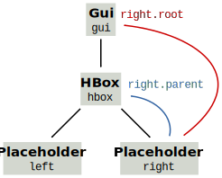
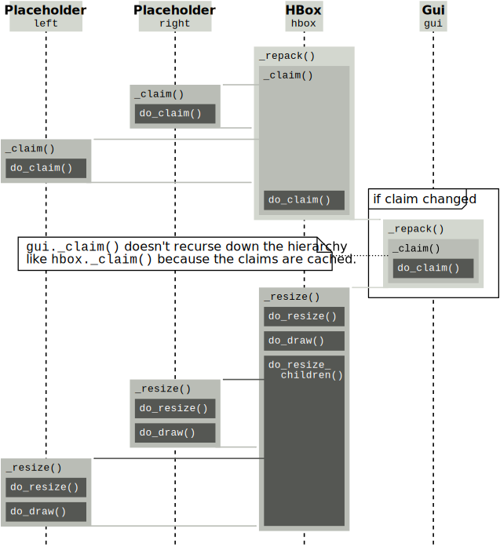

****************
How it all works
****************

Hopefully the tutorials up to this point have done a good job describing how to 
use glooey.  The next step is to understand how glooey works under the hood.  
For example, what needs to happen when a widget is added to the GUI, or when a 
widget needs to be drawn, or when a widget changes size?  The answers to these 
questions will become more and more relevant as you start customizing widgets 
in more and more advanced ways, and inevitably start running into more and more 
obscure problems.  This tutorial aims to give the foundation you'll need to 
solve such problems.

The widget hierarchy
====================
The first thing to understand is that the widgets are organized into a 
hierarchy.  Most of this tutorial will basically be devoted to explaining how 
this hierarchy affects things like how widgets are drawn, or how they're 
positioned, or how they handle mouse events.  Before we get to any of that, 
though, we need to be on the same page about what the hierarchy is.  Take this 
GUI as a simple example:

.. demo:: how_it_all_works/hierarchy.py

   import pyglet
   import glooey

   window = pyglet.window.Window()

   gui = glooey.Gui(window)
   hbox = glooey.HBox(); hbox.padding = 10
   left = glooey.Placeholder()
   right = glooey.Placeholder()

   hbox.add(left)
   hbox.add(right)
   gui.add(hbox)

   pyglet.app.run()

The `Gui` widget is the root of the hierarchy.  Its child is the `HBox` widget, 
and the HBox's two children are the `Placeholder` widgets.  Every widget has a 
`~Widget.parent` property that can be used to get its immediate parent (or 
``None`` if it doesn't have one) and a `~Widget.root` property that can be used 
to get the root widget (or ``None`` if it isn't attached to the hierarchy):

To be clear, a widget is only attached to the hierarchy if it, its parent, or 
one of its grandparents is the root.  For example, in the previous snippet::

   hbox.add(left)
   hbox.add(right)  # Nothing is attached to the hierarchy...
   gui.add(hbox)    # Everything is attached to the hierarchy.

It's unusual to need to react to a widget being attached or detached from the 
hierarchy, but there are ways to do so.  When a widget is attached, glooey 
calls its `~Widget.do_attach()` method and emits an ``on_attach`` event.  
Likewise, when a widget is detached, glooey calls its `~Widget.do_detach()` 
method and emits an ``on_detach`` event.  The `~Widget.root` property is 
guaranteed to be set when both sets of events/methods are triggered.

The most common way to attach or detach widgets from the hierarchy is to call 
public methods like ``add()`` or ``remove()`` of container widgets like `Grid`, 
`HBox`, and `VBox`.  Under the hood, however, widgets are attached using 
`~Widget._attach_child()` and detached using `~Widget._detach_child()`.  
Widgets that use these methods take responsibility for positioning their 
children, but this responsibility will be described further in the section on 
`How repacking works`_.

How drawing works
=================
Drawing is the process by which widgets render themselves to the screen.  
Glooey automatically initiates this process whenever a widget changes size, but 
widgets can also initiate it manually by calling their `~Widget._draw()` method 
(e.g.  a health bar widget would have to redraw itself whenever its health 
changes, since that's not associated with a change in size).  The 
`~Widget._draw()` method first checks to make sure the widget has all of the 
following properties defined:

1. `~Widget.rect`: a position and size.  This information depends on the 
   positions and sizes of all the other widgets in the GUI, and is worked out 
   when the GUI is repacked.  See `How repacking works`_ for more detail.

2. `~Widget.group`: a pyglet graphics group.  This determines how the widget is 
   drawn relative to other widgets, i.e. is it on top, is it translated, is it 
   clipped, etc.  The widget's group comes from its parents.  See `How 
   regrouping works`_ for more detail.

3. `~Widget.batch`: a pyglet graphics batch.  This keeps all the vertex data 
   for the whole GUI as contiguous as possible for efficient rendering.  You 
   can find more information about what a batch is and how it's used in the 
   `pyglet documentation`__.  The whole GUI shares a single batch, and that 
   batch is stored in the root widget, so a widget just needs to be attached to 
   the hierarchy to have access to the batch.

__ http://pyglet.readthedocs.io/en/latest/programming_guide/graphics.html#batched-rendering

If all this information is available, `~Widget._draw()` calls 
`~Widget.do_draw()`, which can be overridden in subclasses to do the actual 
work of drawing the widget.  Implementing this method correctly requires 
keeping in mind that it may be called multiple times.  The first time it's 
called, it should create vertex lists (associated with the batch) for 
everything that needs to be drawn.  After that, it should just update those 
vertex lists as necessary. 

.. note::
   
   Methods in the glooey framework are prefixed according to how they should be 
   used.  The ``_`` prefix indicates that a method should only be called from  
   subclasses of Widget and should *not* be overridden in subclasses.  The 
   ``do_`` prefix indicates that a method exists to be overridden in 
   subclasses, but should only be called internally by glooey.

The opposites of the two drawing methods are `~Widget._undraw()` and 
`~Widget.do_undraw()`.  The former is called when a widget shouldn't be drawn 
anymore.  It simply calls the latter unconditionally, which should be 
overridden in subclasses to undo any work done in `~Widget.do_draw()`.  
Typically this means calling 
:meth:`~pyglet.graphics.vertexdomain.VertexList.delete` on one or more vertex 
lists.  The only caveat is that because `~Widget.do_undraw()` can be called 
several times in a row or even before the widget has been drawn in the first 
place, so care must be taken to avoid deleting vertex lists that don't exist.

The snippet below demonstrates how you'd implement these methods to make a 
widget that fills itself with a solid color:

.. demo:: how_it_all_works/drawing.py

   class BlueRectangle(glooey.Widget):
       custom_alignment = 'center'
       custom_size_hint = 300, 200

       def __init__(self):
           super().__init__()
           self.vertex_list = None

       def do_claim(self):
           return 0, 0

       def do_draw(self):
           vertices = (
                   self.rect.bottom_left.tuple + 
                   self.rect.bottom_right.tuple + 
                   self.rect.top_right.tuple + 
                   self.rect.top_left.tuple
           )
           blue = 1, 71, 108

           # Only make a new vertex_list the first time `do_draw()` is called.  
           # After that, just update its position (in case the widget moved).
           if self.vertex_list is None:
               self.vertex_list = self.batch.add(
                       4, pyglet.gl.GL_QUADS, self.group,
                       ('v2f', vertices), ('c3B', 4 * blue)
               )
           else:
               self.vertex_list.vertices = vertices

       def do_undraw(self):
           if self.vertex_list is not None:
               self.vertex_list.delete()
               self.vertex_list = None

Specifying vertices like this gives you the full power of OpenGL, but it's also 
complex and low-level.  Pyglet and glooey provide simpler alternatives for some 
common things to draw.  For images you can use `pyglet.sprite.Sprite`:

.. demo:: how_it_all_works/sprite.py

   class SpriteDemo(glooey.Widget):
       custom_alignment = 'center'

       def __init__(self):
           super().__init__()
           self.sprite = None

       def do_claim(self):
           return 200, 200

       # Glooey calls this method when the widget is assigned a new group.
       # See the section on `How regrouping works` for more details.
       def do_regroup(self):
           if self.sprite is not None:
               self.sprite.batch = self.batch
               self.sprite.group = self.group

       def do_draw(self):
           if self.sprite is None:
               self.sprite = pyglet.sprite.Sprite(
                       img=pyglet.image.load('wesnoth_logo.png'),
                       x=self.rect.left,
                       y=self.rect.bottom,
                       batch=self.batch,
                       group=self.group,
               )
           else:
               self.sprite.set_position(
                       x=self.rect.left,
                       y=self.rect.bottom,
               )

       def do_undraw(self):
           if self.sprite is not None:
               self.sprite.delete()
               self.sprite = None

For rectangles, you can use the `glooey.drawing.artists.Rectangle` artist.  
This class is a little easier to use than Sprite because it has 
:meth:`~glooey.drawing.Artist.hide` and :meth:`~glooey.drawing.Artist.show` 
methods that do the right thing regardless of whether or not they've been 
called previously.

.. demo:: how_it_all_works/rectangle.py

   class RectangleDemo(glooey.Widget):
       custom_alignment = 'center'
       custom_size_hint = 300, 200

       def __init__(self):
           super().__init__()
           self.artist = glooey.drawing.Rectangle(
                   color=(1, 71, 108),
                   hidden=True, # Don't draw the rectangle yet.
           )

       def do_claim(self):
           return 0, 0

       # Glooey calls this method when the widget is assigned a new group.
       # See the section on `How regrouping works` for more details.
       def do_regroup(self):
           self.artist.batch = self.batch
           self.artist.group = self.group

       # Glooey calls this method when the widget is assigned a new size.
       # See the section on `How repacking works` for more details.
       def do_resize(self):
           self.artist.rect = self.rect

       def do_draw(self):
           self.artist.show()

       def do_undraw(self):
           self.artist.hide()

Glooey comes with a handful of other artists as well.  All are described in the 
`API documentation <glooey.drawing.artists>`, but one that's worth briefly 
highlighting is `glooey.drawing.artists.Background`.  This artist can draw 
rectangles, images, and outlines, and can also tile images along any edge.  In 
short, it's the artist behind the `Background` widget, so it can do everything 
that widget can do.

The last thing to note about drawing is that all widgets have two public 
methods that control whether or not they are drawn.  The first is 
`~Widget.hide()`, which undraws the widget and prevents it from being drawn in 
the situations where it normally would be.  The second is `~Widget.unhide()`, 
which does the opposite.

How repacking works
===================
Repacking is the process by which every widget in the GUI is assigned a size 
and position.  The process begins when a widget calls its `~Widget._repack()` 
method, indicating that it's size may have changed and that the whole GUI may 
need to be updated as a result.  In a nutshell, the `~Widget._repack()` method 
ascends the widget hierarchy until it finds a widget that doesn't need to be 
resized, then descends the hierarchy from there resizing all that widget's 
children and grandchildren.

   A sequence diagram illustrating what would happen if the HBox from the 
   widget hierarchy discussed in the first section were repacked (e.g. when 
   it's attached to the GUI).  Methods that are meant to be overridden in 
   Widget subclasses are highlighted with dark backgrounds.

The ascent is controlled by the `~Widget._claim()` method, which determines the 
minimum amount of space a widget needs to fit itself and all its children.  If 
this amount of space has changed since the last repack, then the ascent must 
continue in case the widget's parent needs to be resized in turn.  Otherwise, 
it can stop.

The `~Widget._claim()` method determines the minimum amount of space needed by 
a widget in several steps.  The first is to recursively call `~Widget._claim()` 
on all the widget's children, to make sure their claims are up-to-date.  This 
is important, because a widget's claim often depends on its children's claims.  
The second step is to delegate the real calculation to `~Widget.do_claim()`.  
This method can be overridden in widget subclasses to return the correct size 
for that kind of widget, accounting for the properties of the widget itself and 
the sizes of all its children.  The third and final step is to adjust the size 
returned by `~Widget.do_claim()` to account for padding.  This final claim is 
stored in the widget and made available (e.g. to parent widgets) via its 
`~Widget.claimed_width`, `~Widget.claimed_height`, and `~Widget.claimed_rect` 
properties.

The descent in executed by the `~Widget._resize()` method, which is recursively 
called by parent widgets on any of their children that need to be resized.  It 
takes as an argument the max rect for the widget being resized (see the 
`padding_alignment_size_hints` tutorial for the definition of that term) and 
sets the widget's final size and position by aligning it according to its 
`~Widget.alignment` property within the given max rect.  The remaining steps 
are delegated to methods that can be overridden in subclasses.  First, 
`~Widget.do_resize()` is called to let the widget generally react to its new 
size.  Second, `~Widget.do_draw()` is called --- if the widget has a batch and 
a group as discussed previously --- to let the widget update its appearance on 
the screen.  Finally, `~Widget.do_resize_children()` is called to let the 
widget calculate and assign new sizes to any of its children.

In summary, here are the methods that a widget can reimplement to control the 
repacking process:

`~Widget.do_claim()`
   Return the minimum width and height (in pixels) that the widget needs to 
   render itself.
   
`~Widget.do_resize()`
   React generally to the widget being resized (i.e. do anything that needs to 
   be done other than drawing things or resizing children, which for most 
   widgets is nothing).

`~Widget.do_draw()`
   Draw the widget using pyglet/OpenGL.  This is called automatically during 
   repacking, but may be called at other times, too.

`~Widget.do_resize_children()`
   Call `~Widget._resize()` on any children that need to be resized (typically 
   all of them).  The default for widgets with only one child is to make the 
   child the same size as the widget itself.  Widgets with more than one child 
   must reimplement this method. 

How regrouping works
====================
As discussed in the `How drawing works`_ section, every widget needs to have a 
pyglet graphics group before it can be drawn.  Regrouping is the process by 
which this happens.  More specifically, it's the process by which widgets are 
assigned groups by their parents.

The process begins when the `~Widget._regroup()` method is called on a widget 
to assign it a new group.  This would have to be internally triggered by a 
widget or its parent --- most often when it's attached to the GUI --- because 
`~Widget._regroup()` is not a public method.  The `~Widget._regroup()` method 
does three things.  First, it calls `~Widget.do_regroup()` to give the widget a 
chance to react to its new group.  For the most part, only widgets that are 
managing vertex lists should need to react, and they should react by migrating 
those vertex lists to the new group (which is already available as `self.group 
<Widget.group>`).  Second, it calls `~Widget.do_regroup_children()` to give the 
widget a chance to call `~Widget._regroup()` on each of its children to assign 
them new groups.  The default implementation simply assigns each child to the 
same group as the parent.  Most widgets should accept the default, but widgets 
that rely on more sophisticated OpenGL states, like `ScrollBox` does to 
translate and clip its content, need to reimplement this method to put their 
children in groups that have the right function and that are themselves 
children of the widget's new group.  Third and finally, `~Widget._regroup()` 
attempts to redraw the widget, so that any changes to the group will be 
immediately reflected.

.. note::

   I mention above that regrouping is usually triggered internally by glooey 
   when a widget is added to the GUI.  You only need to worry about this if you 
   are writing a custom container widget.  That is, a widget that uses 
   `~Widget._attach_child()` and `~Widget._detach_child()` to add and remove 
   children after it's been constructed.  If you're doing this, make sure to 
   always call `~Widget._repack_and_regroup_children()` afterwards to trigger a 
   repack and a regroup if necessary.

How mouse events work
=====================
Pyglet emits mouse events whenever the user moves, clicks, or drags the mouse.  
These events need to propagate through the widget hierarchy in order for each 
widget to react properly when the mouse interacts with it.  This process begins 
with the root widget (which is automatically configured to receive every mouse 
event that pyglet emits) but is ultimately handled in the same way by every 
widget:

First, the event handler corresponding to the particular mouse event is 
triggered, either by pyglet (if the widget in question is the root) or by the 
widget's parent (if not).  Each widget has a handler for each type of mouse 
event that pyglet can generate:

- `~Widget.on_mouse_press(x, y, button, modifiers)`
- `~Widget.on_mouse_release(x, y, button, modifiers)`
- `~Widget.on_mouse_motion(x, y, dx, dy)`
- `~Widget.on_mouse_enter(x, y)`
- `~Widget.on_mouse_leave(x, y)`
- `~Widget.on_mouse_drag(x, y, dx, dy, buttons, modifiers)`
- `~Widget.on_mouse_drag_enter(x, y)`
- `~Widget.on_mouse_drag_leave(x, y)`
- `~Widget.on_mouse_scroll(x, y, scroll_x, scroll_y)`

All of these handlers do different things, of course, but they share the same 
basic structure.  First, the handler calls 
`~Widget._Widget__find_children_under_mouse()` to figure out both which of its 
children are under the mouse now and which were under the mouse the last time a 
mouse event was triggered.  With this information, the handler propagates the 
mouse event to any children affected by it.  Most of the time this just means 
triggering the same event for the children which are under the mouse, but the 
"motion" and "drag" handlers will also trigger "enter" and "exit" events when 
they notice the mouse moving between their children.  Once the event is done 
propagating, the handler may trigger one or more new events.  This is where 
different handlers behave differently.  For example, 
`~Widget.on_mouse_release()` triggers ``on_click`` if the widget is "enabled" 
and the click began in the widget, and ``on_double_click`` if this is the 
second click in the last 500 ms.  Likewise, many of the handlers play a role in 
triggering ``on_rollover`` events at the right times.

There are a number of ways for widget subclasses affect how mouse events are 
propagated.  The first is to reimplement `~Widget.is_under_mouse()`.  This 
method takes a mouse coordinate and returns true if that coordinate is touching 
the widget.  The default implementation returns true if the coordinate is 
within the widget's rectangle, but you can imagine reimplementing this for 
widgets irregular shapes.  Circular widgets are common, for example, and it's 
easy to calculate if a point is within a circle.  You could also support 
arbitrary outlines by using a bitmap to determine which pixels are inside a 
widget.  

The second way to affect how mouse events are propagated is to reimplement 
`~Widget.do_find_children_near_mouse()`.  This method's job is to yield which 
of the widget's children could be under the given mouse coordinate 
(`~Widget.is_under_mouse()` will subsequently be called on each one to figure 
out which really are under the mouse).  The default is to yield all of the 
widget's children, which is always correct, but not always efficient.  
Containers like Grid, HBox, and VBox know where their children are located, so 
they can yield the right widgets in constant time rather than linear time.  
This efficiency matters, because ``on_mouse_motion`` events are triggered 
almost every frame, and often need to be propagated through several layers of 
containers.

The third way to affect how mouse events are propagated is to set 
`~Widget.custom_propagate_mouse_events` to ``False``.  This instructs the 
widget to simply not propagate mouse events, which can be useful if you're 
making a composite widget and want to take complete responsibility for 
interacting with the mouse, or if you just know that nothing it the widget 
should interact with the mouse and you want to save some time.

The fourth way to affect how mouse events are propagated is to call 
`~Widget._grab_mouse()` and (subsequently) `~Widget._ungrab_mouse()`.  The 
first method breaks the normal manner is which mouse events are propagated and 
forces them all to be directed towards the widget that grabbed the mouse, and 
the second method restores undoes this.  The grips inside scroll bars are a 
good example of when these methods are useful.  When you click the grip, it 
grabs the mouse so that even if the mouse leaves the scroll bar as you're 
dragging, the grip keeps moving with the mouse.  Then when you release the 
grip, it ungrabs the mouse and everything goes back to normal.  Only one widget 
can grab the mouse at a time.  If you try to grab it twice, and exception will 
be raised.

The last way to affect how mouse events are propagated is to overwrite the 
handlers, e.g. `~Widget.on_mouse_press()` and friends.  This is the nuclear 
option, so to speak, but it lets you propagate events in any way you like.  For 
example, the Mover widget --- one of the fundamental building blocks of the 
scrolling widgets --- is responsible for efficiently moving a child around.  
But under the hood, the child isn't really moving; Mover is just using 
``glTranslate()`` in order to change where it's drawn.  In order for this trick 
to work, Mover also needs to reimplement the mouse handlers to apply the 
inverse translation to the mouse coordinates, otherwise there would be a 
mismatch between where the child appeared and where it could be clicked on.  
Another example is the PanningGui widget, which reimplements these methods so 
it can take responsibility for tracking the position of the mouse (i.e. by 
adding up dx and dy every time the mouse moves).  This allows it to trigger 
``on_mouse_pan`` events when the mouse appears to move off the screen, which 
can then be used to scroll around a larger scene in the way that many games do.
